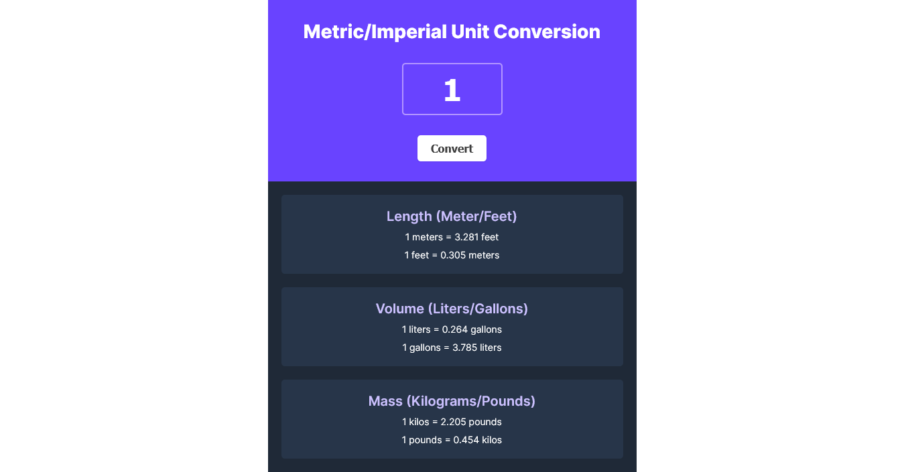

# Scrimba Bootcamp - Solo Projects

This is a solution to the [M3 - Unit Conversion](https://scrimba.com/learn/frontend/solo-project-pro-unit-converter-cz9aPNSr).

## Screenshot

## Links

- Live Site: [Netlify](https://enchanting-tiramisu-9ea6b5.netlify.app/)
- Codebase: [Github](https://github.com/abilioassis/unit-conversion)
- Code review: [Scrimba]()

## Built with

- Semantic HTML5 markup.
- Flexbox.
- No frameworks (only pure HTML and CSS 🏅).

## Author

- [Abilio Assis](https://www.linkedin.com/in/abilio-assis/)
